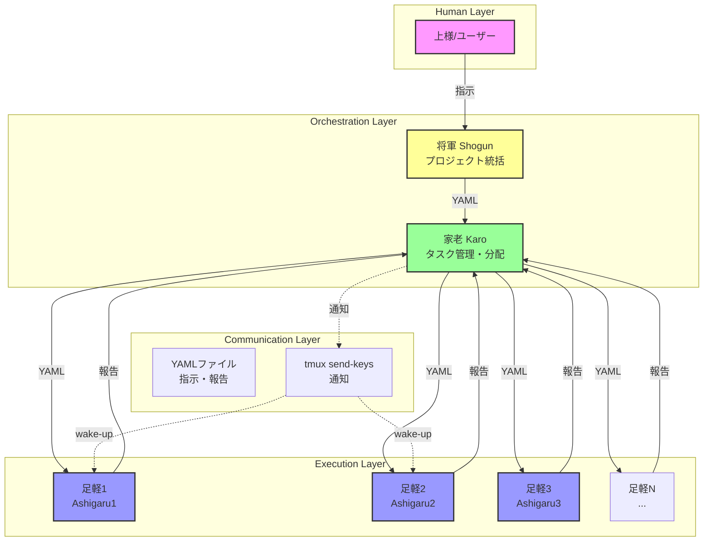
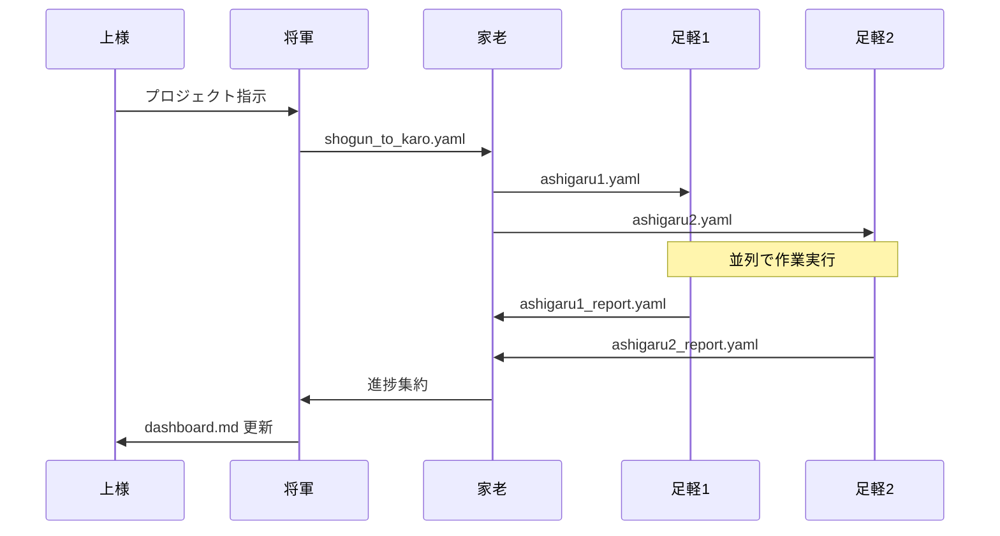
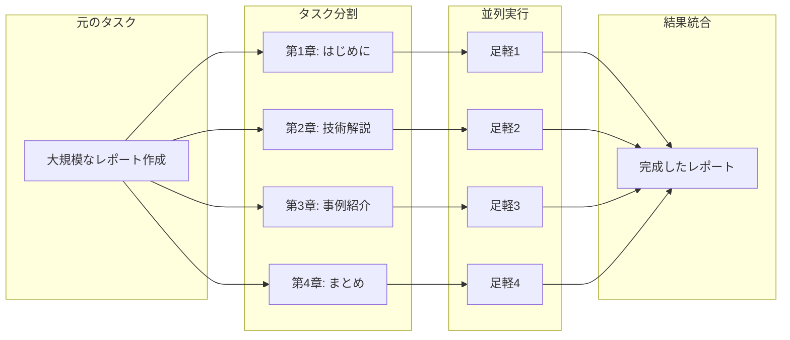
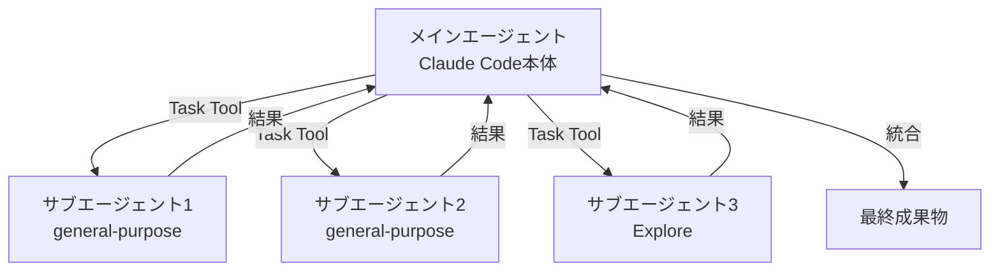
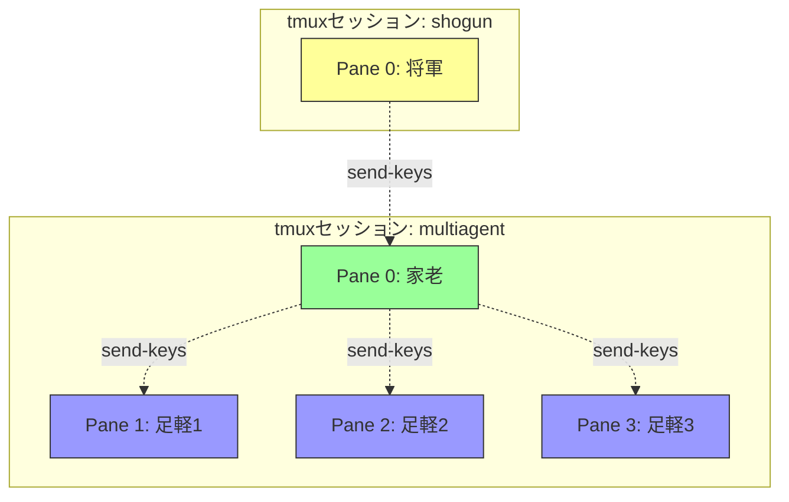
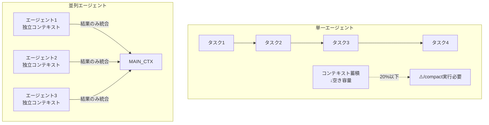

# Claude Code 並列実行システム概要

> **Version**: 1.0.0
> **Created**: 2026-01-29
> **Author**: Ashigaru1 (with Senior Software Engineer persona)

---

## 1. 並列実行システムとは

### 1.1 基本概念

Claude Codeの並列実行システムは、**複数のAIエージェントを同時に起動し、それぞれが独立したコンテキストで作業を行う仕組み**です。

```
従来の逐次実行          並列実行
─────────────────     ─────────────────
Task1 → Task2 → Task3  Task1 ─┐
                         Task2 ├→ 同時に実行
                         Task3 ┘
```

**メリット**
- 作業時間の短縮（理論上、1/Nに圧縮可能）
- コンテキストの分離（各エージェントが独立して思考可能）
- 専門化（役割分担による品質向上）

---

## 2. システムアーキテクチャ

### 2.1 全体構成図



### 2.2 通信プロトコル



**重要な設計思想**
- **イベント駆動**: ポーリング禁止（API代金節約）
- **非同期通信**: 各エージェントが自分のペースで作業
- **YAMLベース**: 指示・報告を構造化されたファイルでやり取り

---

## 3. 並列実行のパターン

### 3.1 パターン分類

| パターン | 説明 | 適用例 |
|----------|------|--------|
| **分業型** | タスクを分割して各エージェントが担当 | ドキュメントの章別執筆 |
| **投票型** | 同じタスクを複数エージェントで実行し結果を比較 | コードレビーの多重チェック |
| **パイプライン型** | 出力を次のエージェントの入力にする | 翻訳→校正→フォーマット |
| **競争型** | 最初に完了した結果を採用 | 複数アプローチの並列探索 |

### 3.2 分業型の詳細



### 3.3 パイプライン型の詳細


---

## 4. Claude Codeでの実装方式

### 4.1 Task Toolによるサブエージェント起動

Claude Codeには `Task` ツールがあり、これを使ってサブエージェントを起動できます。



**実装例（擬似コード）**

```python
# Claude Codeでの並列実行イメージ
results = await asyncio.gather(
    Task("general-purpose", "章1を執筆"),
    Task("general-purpose", "章2を執筆"),
    Task("general-purpose", "章3を執筆"),
)

# 結果を統合
final_document = merge(results)
```

### 4.2 tmux + 複数セッション方式

multi-agent-shogunで採用している方式です。



**メリット**
- 各ペインで独立したClaude Codeセッションが動作
- 人間がリアルタイムで状況を監視可能
- YAMLファイルによる永続的な指示・報告の記録

---

## 5. コンテキスト管理の重要性

### 5.1 コンテキストウィンドウの問題



### 5.2 コンテキスト分散のベストプラクティス

| 対策 | 説明 | 効果 |
|------|------|------|
| Task Tool活用 | サブエージェントに作業を委譲 | メインコンテキストを肥大化させない |
| /compact実行 | 古い会話を要約 | 空き容量を確保 |
| 結果のみ統合 | サブエージェントの詳細ログは破棄 | 必要な情報だけを保持 |

---

## 6. 用語集

| 用語 | 読み | 説明 |
|------|------|------|
| 将軍 | しょうぐん | プロジェクト全体を統括するエージェント |
| 家老 | かろう | タスクの管理・分配を行うエージェント |
| 足軽 | あしがる | 実際の作業を行う実働エージェント |
| 上様 | うえざま | ユーザー（人間）の敬称 |
| ポーリング | polling | 定期的に状態を確認しに行くこと（非推奨） |
| イベント駆動 | event-driven | 状態変化時にのみ通知を受け取る方式 |

---

## 7. まとめ

Claude Codeの並列実行システムは、以下の要素で構成されます：

1. **階層構造**: 将軍 → 家老 → 足軽
2. **通信プロトコル**: YAMLファイル + tmux send-keys
3. **並列パターン**: 分業型・投票型・パイプライン型・競争型
4. **実装方式**: Task Tool または tmux複数セッション
5. **コンテキスト管理**: 分散と要約で効率化

次章では、具体的な実装手順について詳しく解説します。
